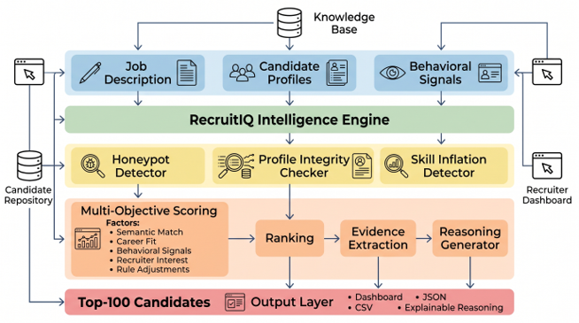
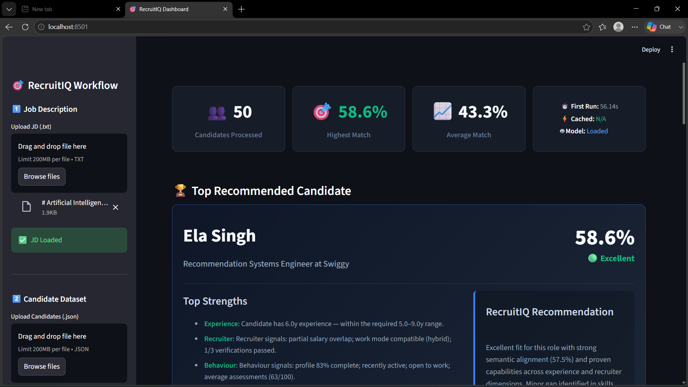
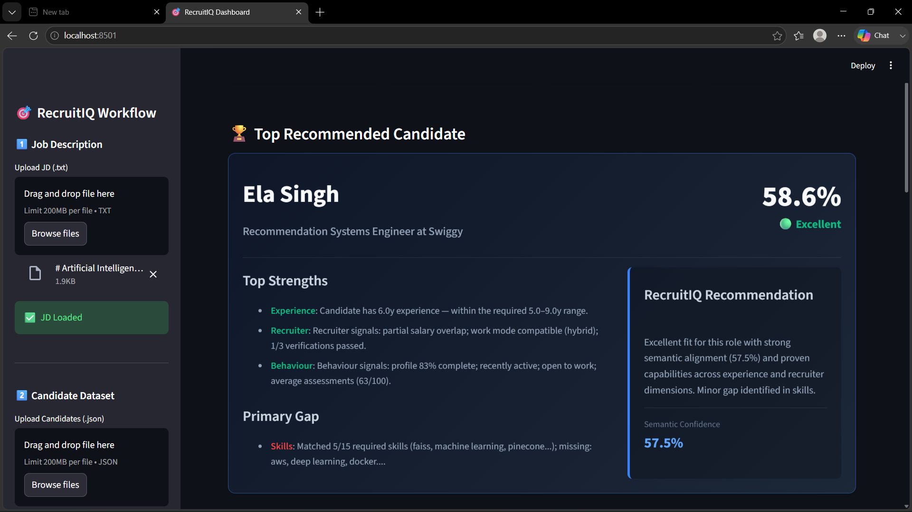
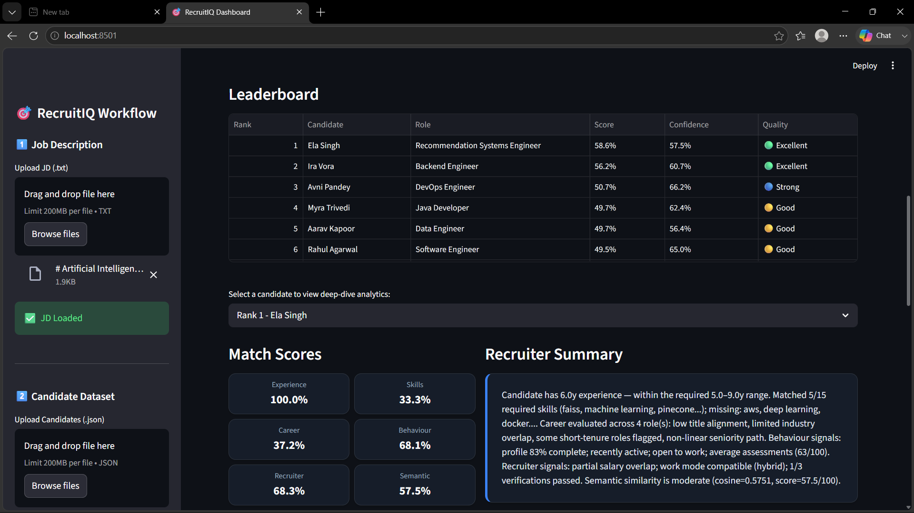
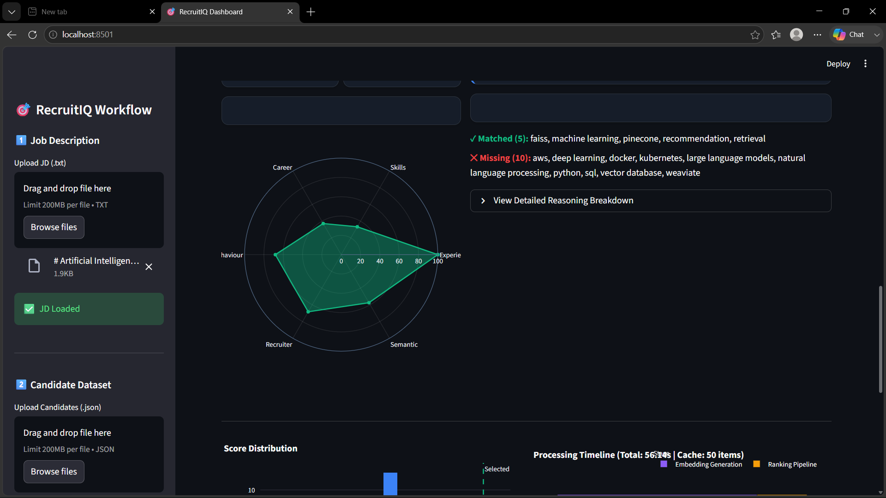
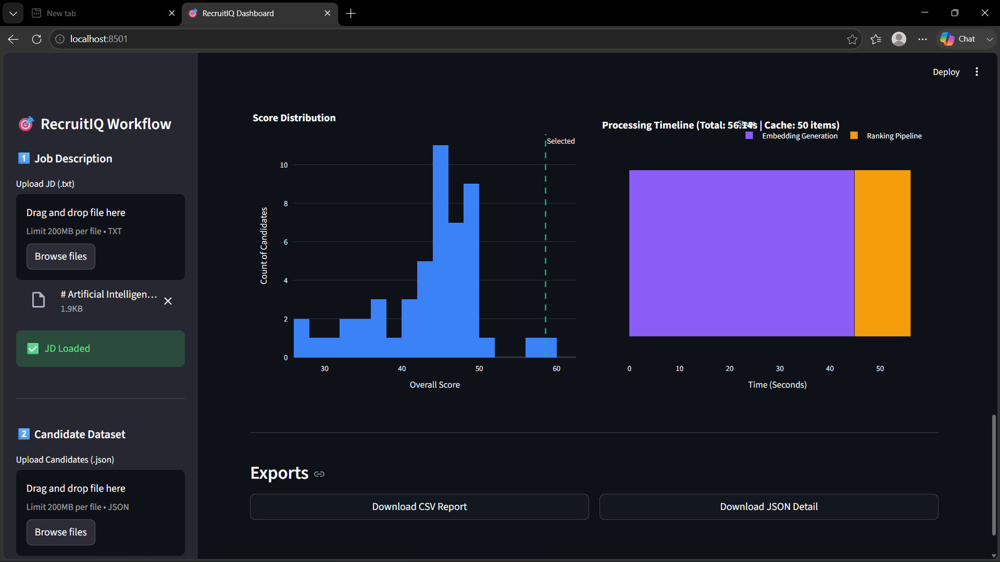

# 🚀 RecruitIQ

<h3 align="center">
AI Hiring Intelligence Platform
</h3>

<p align="center">
<b>Finding the Best Candidate Beyond Keywords using Hybrid AI & Explainable Intelligence</b>
</p>

<p align="center">


</p>

---

## 📖 Overview

RecruitIQ is an **AI-powered Hiring Intelligence Platform** designed to help recruiters identify the most suitable candidates beyond simple keyword matching.

Traditional Applicant Tracking Systems (ATS) often overlook strong candidates because they rely heavily on exact keyword matches. RecruitIQ overcomes this limitation by combining **semantic understanding, structured candidate evaluation, recruiter signals, behavioral intelligence, and explainable AI** into a unified ranking engine.

Instead of simply assigning a score, RecruitIQ explains **why** each candidate is recommended, enabling recruiters to make faster, more informed, and transparent hiring decisions.

---

# ✨ Key Features

- 🧠 AI-powered Job Description Intelligence
- 👥 Candidate Intelligence Engine
- 🎯 Hybrid Multi-Factor Ranking Engine
- 🔍 Semantic Matching using Sentence Transformers
- 📊 Explainable AI Score Breakdown
- 📈 Interactive Recruiter Dashboard
- 📂 CSV & JSON Export
- ⚙️ Adjustable Ranking Weights
- 📉 Candidate Analytics & Visualizations
- 🚀 Recruiter-Friendly Workflow

---

# 🏗️ System Architecture

<p align="center">



</p>

RecruitIQ follows a modular AI pipeline consisting of:

- Job Description Intelligence
- Candidate Feature Engineering
- Hybrid AI Matching
- Explainable Ranking
- Dashboard & Export Layer

---

# 🔄 End-to-End Workflow

```
Job Description
        │
        ▼
JD Intelligence Engine
        │
        ▼
Candidate Feature Engineering
        │
        ▼
Hybrid AI Matching
        │
        ▼
Semantic Intelligence
        │
        ▼
Weighted Score Aggregation
        │
        ▼
Explainable AI
        │
        ▼
Interactive Dashboard
```

---

# 🧠 Hybrid AI Ranking Engine

RecruitIQ evaluates every candidate across six independent dimensions.

| AI Module | Purpose |
|------------|---------|
| 📌 Experience Matcher | Evaluates experience suitability |
| 💻 Skill Matcher | Matches technical & domain skills |
| 📈 Career Matcher | Analyzes career growth & stability |
| 👤 Behaviour Matcher | Evaluates behavioral & activity signals |
| 🤝 Recruiter Matcher | Measures hiring feasibility |
| 🧠 Semantic Matcher | Understands contextual profile similarity |

Each module produces an explainable score which is combined through a configurable weighted aggregation model.

---

# 📊 Explainable AI

Unlike conventional ranking systems, RecruitIQ provides complete transparency behind every recommendation.

Each candidate includes:

- Overall Match Score
- Experience Analysis
- Skill Match Analysis
- Career Intelligence
- Behaviour Signals
- Recruiter Signals
- Semantic Similarity
- AI Recommendation Summary
- Evidence-Based Reasoning

This enables recruiters to understand **why** a candidate has been recommended rather than relying on a black-box score.

---

# 🖥️ Dashboard

<p align="center">






</p>

The Streamlit dashboard includes:

- Guided Recruiter Workflow
- Job Description Upload
- Candidate Dataset Upload
- Hiring Priority Controls
- KPI Cards
- Top Candidate Spotlight
- Interactive Leaderboard
- Candidate Deep-Dive Panel
- Match Score Radar Chart
- Score Distribution
- Processing Timeline
- CSV Export
- JSON Export

---

# ⚙️ Technology Stack

### Programming

- Python

### Artificial Intelligence

- Sentence Transformers
- Hybrid AI Ranking
- Semantic Similarity
- Explainable AI

### Machine Learning

- Scikit-learn
- NumPy
- Pandas

### Dashboard

- Streamlit
- Plotly

### Data Processing

- JSON
- CSV

### Version Control

- Git
- GitHub

---

# 📂 Project Structure

```
RecruitIQ/

│
├── app.py
├── requirements.txt
├── README.md
│
├── assets/
│     ├── dashboard.png
│     └── architecture.png
│
├── data/
│     ├── raw/
│     └── output/
│
├── src/
│     ├── analyzers/
│     ├── config/
│     ├── core/
│     ├── factories/
│     ├── jd_engine/
│     ├── knowledge/
│     ├── knowledge_engine/
│     ├── matching/
│     ├── models/
│     ├── ui/
│     └── utils/
│
└── requirements.txt
```

---

# 🚀 Installation

Clone the repository

```bash
git clone https://github.com/GitROG09/RecruitIQ.git
```

Move into the project

```bash
cd RecruitIQ
```

Create Virtual Environment

### Windows

```bash
python -m venv .venv
.venv\Scripts\activate
```

### Linux / macOS

```bash
python3 -m venv .venv
source .venv/bin/activate
```

Install dependencies

```bash
pip install -r requirements.txt
```

---

# ▶️ Run RecruitIQ

Launch the Streamlit Dashboard

```bash
streamlit run app.py
```

The dashboard will open locally in your browser.

---

# 📤 Outputs

RecruitIQ generates:

- 📊 Ranked Candidate Leaderboard
- 📈 Interactive Dashboard Analytics
- 📄 CSV Ranking Report
- 📂 JSON Explainability Report

---

# 📈 Future Scope

- 🤖 LLM-powered Recruiter Assistant
- 📄 Resume Parsing (PDF/DOCX)
- 🎙️ Interview Transcript Analysis
- ⚖️ Bias Detection & Fairness Monitoring
- 🌐 ATS Integration
- ☁️ Cloud Deployment
- 🔄 Continuous Learning Ranking Engine
- 👥 Multi-Recruiter Collaboration

---

# 👥 Team

**Team Name:** *TechTwins*

**Team Leader:** Gitesh Patil

**Team Member:** Vaibhavi Khilare


---

# 🏆 Hackathon

Developed for the **Redrob AI Hiring Challenge**.

RecruitIQ demonstrates how **Hybrid AI + Semantic Intelligence + Explainable AI** can significantly improve candidate screening and recruiter decision-making.

---

# ⭐ Support

If you found this project interesting, consider giving it a ⭐ on GitHub.

It motivates us to continue building impactful AI solutions.

---

<p align="center">

<b>RecruitIQ • AI Hiring Intelligence Platform</b>

Made with ❤️ using Python, Streamlit & Explainable AI

</p>
